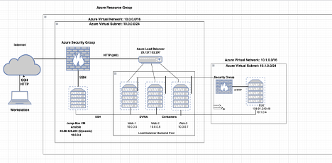

## Automated ELK Stack Deployment

The files in this repository were used to configure the network depicted below.

These files have been tested and used to generate a live ELK deployment on Azure. They can be used to either recreate the entire deployment pictured above. Alternatively, select portions of the __YAML__ file may be used to install only certain pieces of it, such as Filebeat.

  - _TODO: ELK-Playbook.yml

This document contains the following details:
- Description of the Topologu
- Access Policies
- ELK Configuration
  - Beats in Use
  - Machines Being Monitored
- How to Use the Ansible Build

### Description of the Topology

The main purpose of this network is to expose a load-balanced and monitored instance of DVWA, the D*mn Vulnerable Web Application.

Load balancing ensures that the application will be highly __effective_, in addition to restricting __Access___ to the network.
- _TODO: What aspect of security do load balancers protect? Load balancers prevent unwanted or unauthorized traffic from reaching the application.
 
What is the advantage of a jump box? Jump boxes add a layer of security to the web servers, preventing the jump boxes from being exposed to the public.

Integrating an ELK server allows users to easily monitor the vulnerable VMs for changes to the __configuration files___ and system __files___.
- _TODO: What does Filebeat watch for?_Filebeat watches for log files or log events
- _TODO: What does Metricbeat record?_ Metricbeat records metrics from on going services on the server

The configuration details of each machine may be found below.
_Note: Use the [Markdown Table Generator](http://www.tablesgenerator.com/markdown_tables) to add/remove values from the table_.

| NAME    | Function  | IP Address | Operating System |
|---------|-----------|------------|------------------|
| JumpBox | Gateway   | 10.0.0.4   | Linux            |
| Web-1   | Webserver | 10.0.0.5   | Linux            |
| Web-2   | Webserver | 10.0.0.6   | Linux            |
| Web-3   | Webserver | 10.0.0.7   | Linux            |
| VM-ELK  | Webserver | 10.1.04    | Linux            |

### Access Policies

The machines on the internal network are not exposed to the public Internet. 

Only the _Jump-Box-Provisioner____ machine can accept connections from the Internet. Access to this machine is only allowed from the following IP addresses:
- _TODO: 107.131.52.27

Machines within the network can only be accessed by _Jumpbox____.
- _TODO: Which machine did you allow to access your ELK VM? What was its IP address?_107.131.52.27

A summary of the access policies in place can be found in the table below.

| NAME    | Publicly Accessible | Allowed IP Address |
|---------|---------------------|--------------------|
| JumpBox | Yes                 | 10.0.0.1 10.0.0.2  |
| Web-1   | No                  | 107.131.52.27      |
| Web-2   | No                  | 107.131.52.27      |
| Web-3   | No                  | 107.131.52.27      |
| VM-ELK  | Yes(http)           | 107.131.52.27      |

### Elk Configuration

Ansible was used to automate configuration of the ELK machine. No configuration was performed manually, which is advantageous because...
- _TODO: What is the main advantage of automating configuration with Ansible?_It allows changes to be made within any of the VMs associated with it.

The playbook implements the following tasks:
- _TODO: In 3-5 bullets, explain the steps of the ELK installation play. E.g., install Docker; download image; etc._
1) Install Docker.io
2) Install python3-pip
3) Install Docker Python Module
4) Download and launch a Docker web container
5) Download and launch a docker web container 
- ...

The following screenshot displays the result of running `docker ps` after successfully configuring the ELK instance.

### Target Machines & Beats
This ELK server is configured to monitor the following machines:
- _TODO: List the IP addresses of the machines you are monitoring_
10.0.0.4 10.0.0.5 10.0.0.6 10.0.0.7 10.1.0.4

We have installed the following Beats on these machines:
- _TODO: Specify which Beats you successfully installed_
Filebeat and Metricbeat

These Beats allow us to collect the following information from each machine:
- _TODO: In 1-2 sentences, explain what kind of data each beat collects, and provide 1 example of what you expect to see. E.g., `Winlogbeat` collects Windows logs, which we use to track user logon events, etc._

Filebeat monitors log files and log events. See the following examples: Inputs and harvesters. Metric beat looks out for any information in the file system that have been manipulated. 

### Using the Playbook
In order to use the playbook, you will need to have an Ansible control node already configured. Assuming you have such a control node provisioned: 

SSH into the control node and follow the steps below:
- Copy the _ansible configuration____ file to __run playbooks___.
- Update the __ansible host___ file to include...
- Run the playbook, and navigate to _Jumpbox___ to check that the installation worked as expected.

_TODO: Answer the following questions to fill in the blanks:_
- _Which file is the playbook? The Elk-Playbook.yml
 Where do you copy it?_filebeat-playbook.yml file to /etc/ansible/roles

- _Which file do you update to make Ansible run the playbook on a specific machine? Elk-playbook.yml file

How do I specify which machine to install the ELK server on versus which to install Filebeat on?_By using the IPs of the respective servers
- _Which URL do you navigate to in order to check that the ELK server is running? http://[ELK-VM-IP]:5601/app/kibana

_As a **Bonus**, provide the specific commands the user will need to run to download the playbook, update the files, etc._ansible-playbook elk-playbook.yml
